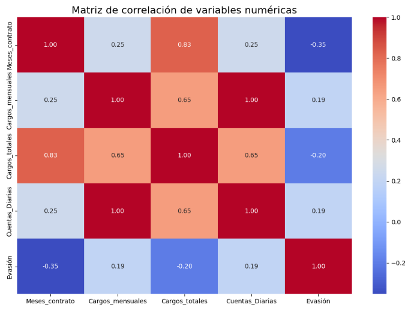
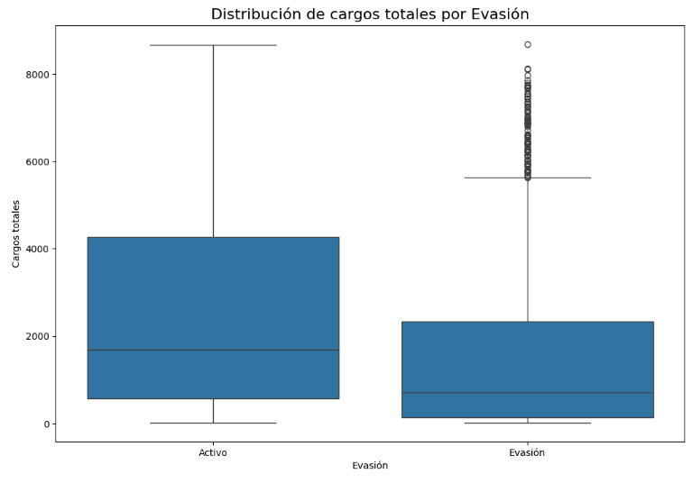
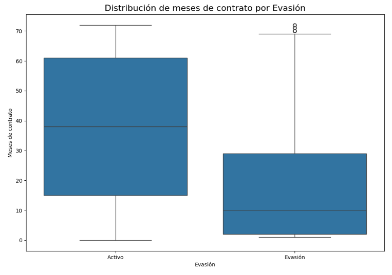
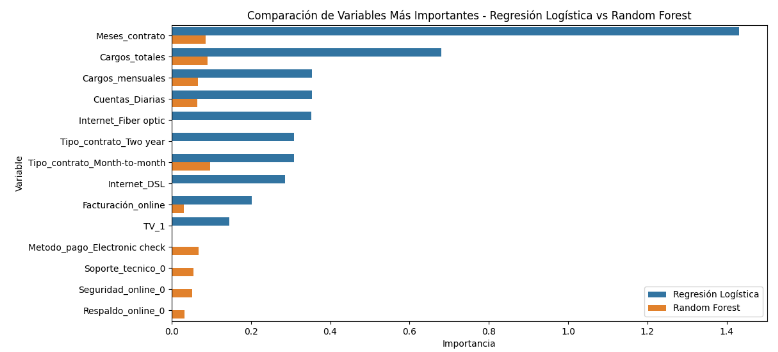

# Challenge-Telecom-X-Parte2
 En el siguiente proyecto se realizó una predicción de evasión de clientes para la empresa Telecom X, mediante la utilización de bibliotecas pandas, matplotlib, seaborn, numpy, imblearn y sklearn, para así lograr un análisis completo y con respuestas claras.
 
 Comenzando por la preparacion de datos, importando las bibliotecas necesarias, datos requeridos, eliminando o codificando columnas, balanceando clases, e incluso normalizando o estandarizando datos para un optimo análisis.
 Después se realizó un anális de correlación con las variables númericas y la evasión, obteniendo el siguiente gráfico:
 
 En donde se observa que para meses de contrato y cargos totales la correlación es negativa, indicando que a mayor meses de contrato o cargos totales menor probabilidad de evasión, por el contrario para cargos mensuales y diarios, a mayor cargos se tienda más a cancelar el servicio.

Finalizando el análisis dirigido (boxplots),se realizó el modelado predictivo mediante la separación de datos y creación de modelos "Regresión logística" y "Random forest", comparándolos aun cuando sus resultados fueron muy similiares pero con tendencia al underfitting y así mejorándolos para un mejor análisis, de esta manera se obtuvieron variables importantes en la probabilidad de evasión, entre las más importantes se encuentran las siguientes:

Concluyendo así que la regresión logística permitió observar el efecto de cada variable sobre la probabilidad de evasión y el random forest apoyó en la definición de más variables por las relaciones no lineales que el primer modelo no considera.

Las variables que coinciden para ambos modelos resultaron ser: meses que se llevan de contrato, cargos totales, cargos mensuales, cuentas diarias, tipo de contrato mes a mes y facturación online, considerandose de esta manera claves para el riesgo de cancelación. Además con los coeficientes generados por el primer modelo se concluye que a mayor duración de contrato la probabilidad de evasión es menor, lo mismo pasa con los cargos mensuales y cuentas diarias, y por el contrario para cargos totales, cuanto más alto es el cargo total la probabilidad de cancelar también aumenta, algo parecido con lo que pasa con tipo de contrato mes a mes y facturacion online, en estos casos si el cliente cuanta con estos servicios también la probabilidad de que cancele es más alta.

Con lo anterior se pueden establecer estrategias para disminuir la probabilidad de cancelación, como el ofrecer beneficios para los clientes con contratos de años y no meses, ofrecer descuentos cuando los cargos totales sean mayores, mejorar el soporte técnico, recordatorios de pago y revisar periodicamente las métricas para detectar clientes en riesgo.

